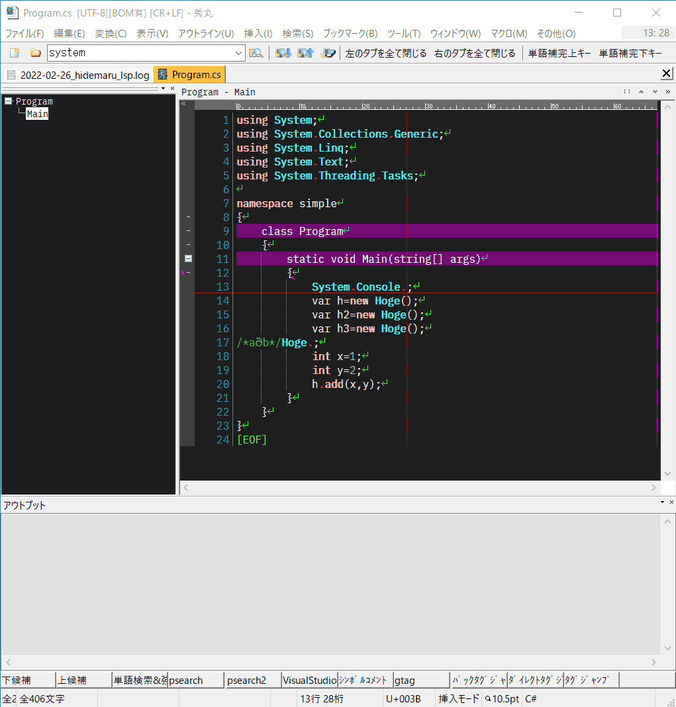
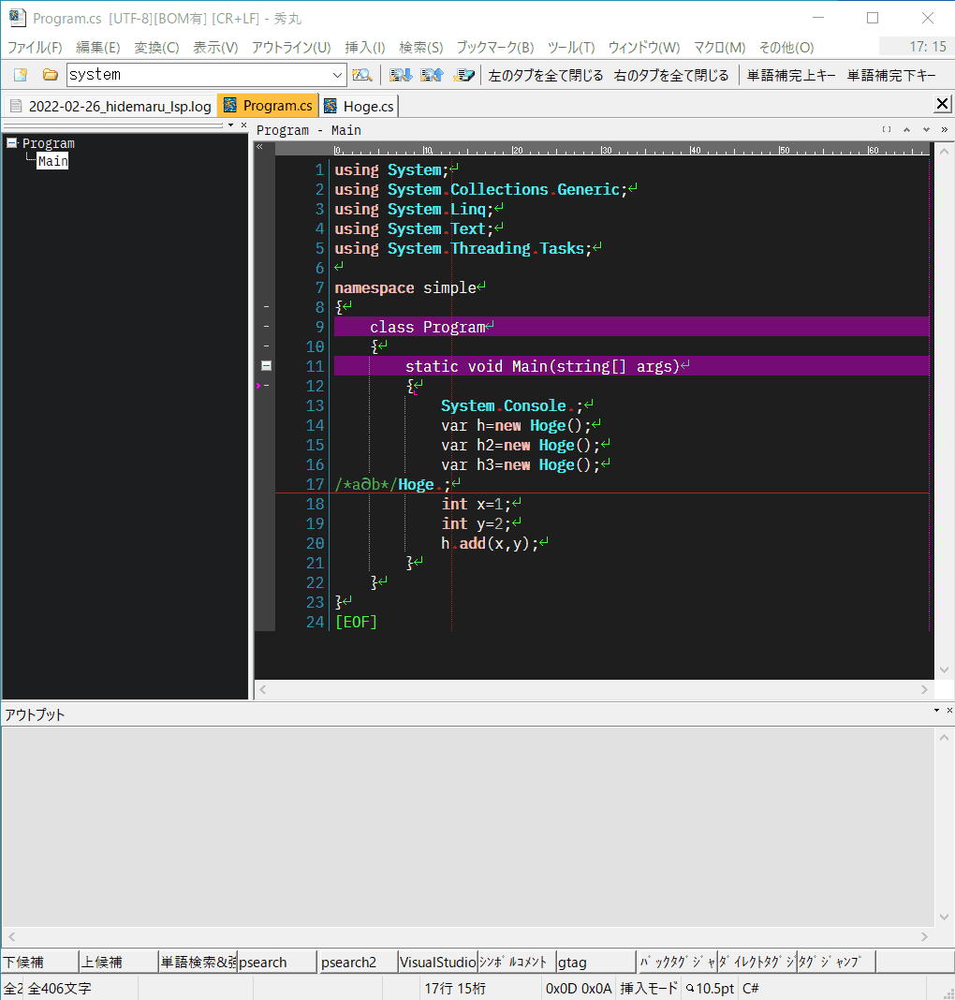

# hidemaru_lsp_client

秀丸エディタから Language Server Protocol (LSP) を利用するマクロ。

## スケジュール感

- 2021年　機能を作りきる
- 2022年　自分の環境で利用し実運用上の問題点を改修する。
- 2023年　version 1.0.0 をリリース

地道にのんびりやってます～

# スクリーンショット

## LspServer起動 → completion

## Hover

# 予めのお断りとお願い

このマクロを使用してみようと思う方は既にある程度のスキルを持っておられるものと推測し、このドキュメントもそのような方が読まれることを前提として書いてあります。 

# できること

|機能|LSP method|実装|
|--|--|:--:|
|補完|textDocument/completion|○|
|Lint|textDocument/publishDiagnostics|○|
|宣言へ移動|textDocument/declaration|○|
|定義へ移動|textDocument/definition|○|
|カーソル位置にあるシンボルの型定義へジャンプする|textDocument/typeDefinition|○|
|カーソル位置のシンボルを参照している箇所へジャンプ|textDocument/references|○|
|実装へ移動|textDocument/implementation|○|
|Hover|textDocument/hover|○|
|CodeLens|textDocument/codeLens|実装中|

### 細々としたメッセージ
|LSP method|実装|
|workspace/didChangeConfiguration|×|
|textDocument/didOpen|○|
|textDocument/didChange|○|
|textDocument/didClose|○|
|textDocument/didSave|実装中|
|workspace/didChangeWatchedFiles||
|textDocument/publishDiagnostics||

## 動作確認した言語サーバ

- clangd
- OmniSharp
- sumneko-lua-language-server
- pyls
- pyls-ms
- Microsoft.Python.LanguageServer
- jedi-language-server
- vim-language-server

# 言語サーバ(LSP)の導入方法

C#,C++,Lua,Python...の各言語サーバ(LSP)は各自で導入してください。

# マクロの導入方法

後で書く

## カスタマイズ

マクロの一部動作をカスタマイズできます。
後で書く

## ログファイル

以下の設定ファイルをテキストエディタで編集してください。

\\hidemaru_lsp_client\\internal\\bin\\HidemaruLspClient_BackEnd-**[x64|x86]**-Release\\**NLog.config**

x64,x86は秀丸エディタに依存します。

***NLog.config***のカスタマイズ詳細はNLogのマニュアルを参照してください。

- [https://nlog-project.org/](https://nlog-project.org/)

# 困った時は

動作ログをテキストエディタなどで確認してください。

%USERPROFILE%\yyyy-mm-dd_hidemaru_lsp.log

## レジストリ削除

Toolsフォルダの以下ファイルを実行してください、本マクロに関連するレジストリを削除します。

- UnRegistAll_x64.bat
- UnRegistAll_x86.bat

## クラッシュレポート送信

作者にクラッシュレポートを送信するように設定すると、このマクロの改善に役立ちます。
ディフォルトで有効です。

### クラッシュレポートを有効化する

server_config.ini
	
	[MacroImprovementProgram]
	;クラッシュレーポートを送信するかどうか
	;有効 1
	;無効 0
	SendCrashReport=1

#### プライバシーポリシー

このマクロでは、マクロの品質改善を目的として以下のサービスを利用しマクロの利用状況、ならびにクラッシュレポートを収集しています。
クラッシュレポートは匿名で作成され、送信を有効化した場合のみ送信されます。

|||
|--|--|
|サービス名|Visual Studio App Center|
|サービス提供会社名|Microsoft|
|取得項目|[参考URL](https://docs.microsoft.com/en-us/appcenter/analytics/export#azure-application-insights|)|

# 謝辞

- coc.nvim
- LanguageClient-neovim
- vim-lsc
- vim-lsp
- neovim
- vim-lsp-settings

ソースコードをかなり参考にさせて頂きました、ありがとうございます😄

# 連絡先

- <https://ohtorii.hatenadiary.jp> 
- <https://twitter.com/ohtorii> 
- <https://github.com/ohtorii>

以上
