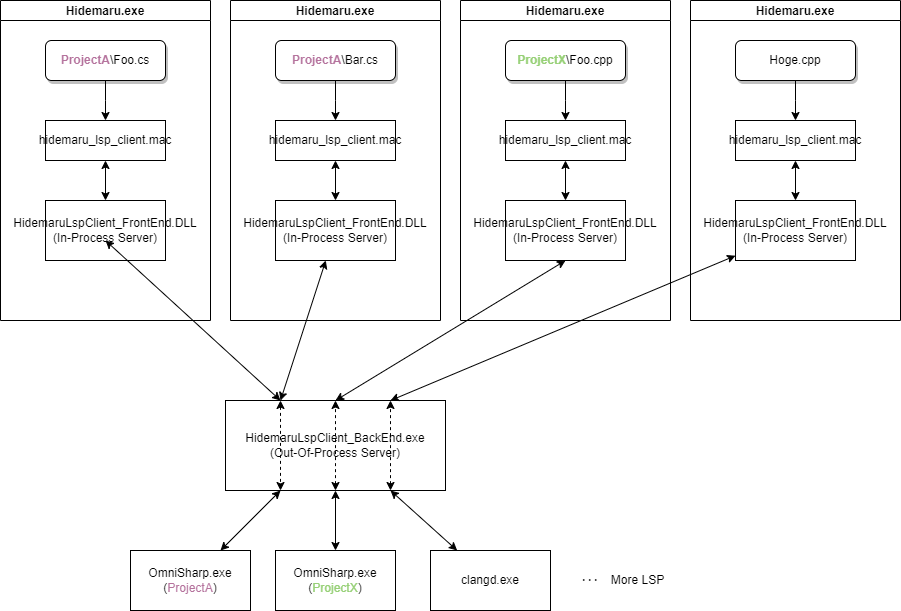

# はじめに

本マクロの内部実装です、重要な箇所のみとりあげています。

# 概要

各プロセスとDLLの全体図です。（図中のファイル名LSPサーバ名は説明用です）

### 秀丸エディタの特長

1. 秀丸エディタはファイル毎にプロセス生成しています、上記図では4ファイルを開き4プロセス生成しています。(VisualStudio,VSCodeのように1プロセスではありません)
2. 秀丸エディタにはプロジェクトのルートフォルダ（通常はCMS<Git,Svn...>のルートフォルダ）という概念がありません

端的に言い表すと秀丸エディタにLSPを組み込むのは難しいです、そこで、秀丸エディタと各言語のLSPをIn-Prcess Server/Out-Of-Process Serverが仲介することで実現しています。

#### プロジェクトのルートフォルダについて

LSPサーバのプロセス（図中の.exe）はプロジェクトのルートフォルダ毎に存在します。

※図中のProjectAフォルダ以下のファイル(Foo.cs,Bar.cs)を参照

#### 捕捉
そもそも、秀丸エディタはテキストエディタなので上記1,2の特長は妥当だと思います😉

# プロジェクトフォルダの指定方法

各LSPサーバに対応する設定(.csファイル)が　***hidemaru_lsp_client\config*** フォルダにあります。
このcsファイルを秀丸マクロ実行時に評価し、

- LSPサーバの実行ファイル名
- LSPサーバの引数
- プロジェクトのルートディレクトリ
- ...etc

を取得しLSPサーバを起動します。

前述のフォルダ中の.csファイルが参照するLanguageServerProcess.DLLは ***LanguageServerProcess*** フォルダを参照してください

# LSP本体

## モデル定義

[Language Server Protocol Specification(version 3.16)](https://microsoft.github.io/language-server-protocol/specification) を参照してC#版のコードを記述します。

**LanguageServerProtocol/Model/*.cs** を参照してください。

## ソースコード説明

|サーバ機能|ファイル|
|--|--|
|プロセス起動|LanguageServerProtocol\Client\LanguageClient.cs|
|stdio通信|LanguageServerProtocol\Client\ServerProcess.cs|
|TCP/IP通信|未実装|
|レスポンス送受信|LanguageServerProtocol\Client\Protocol.cs|

# HidemaruLspClient_BackEnd.exeの内部実装

秀丸エディタとLSPサーバの仲介を行います。

## ソースコード説明

|機能|ファイル|
|--|--|
|インターフェースを記述|HidemaruLspClient_BackEndContract/BackEndContract.idl|
|インターフェース実装|HidemaruLspClient_BackEnd\BackEndContract\\*|

## COMインターフェース定義から実装まで

	HidemaruLspClient_BackEndContract\BackEndContract.idl   //←出発点
	↓
	HidemaruLspClient_BackEndContract.tlb
	↓
	HidemaruLspClient_Contract\bin\tlb2dll.bat              //←.tlbを.dllへ変換(VisualStudioのビルド後イベントで実行)
	↓
	HidemaruLspClient_BackEndContract.dll                   //←HidemaruLspClient_BackEndプロジェクトでインターフェースを実装
	                                                        //←HidemaruLspClient_FrontEndプロジェクトでインターフェース定義を参照

# HidemaruLspClient_FrontEnd.DLLの内部実装

## ソースコード説明

秀丸マクロに不足している機能を提供します。

|機能|ファイル|
|--|--|
|秀丸エディタへ公開するインターフェース|HidemaruLspClient_FrontEnd\IService.cs|
|インターフェースの実装（同期版）|HidemaruLspClient_FrontEnd\Service.cs|
|インターフェースの実装（非同期版）|HidemaruLspClient_FrontEnd\ServiceAsync.cs|

秀丸マクロの実装により非同期版、同期版のどちらかを呼びます。

以上